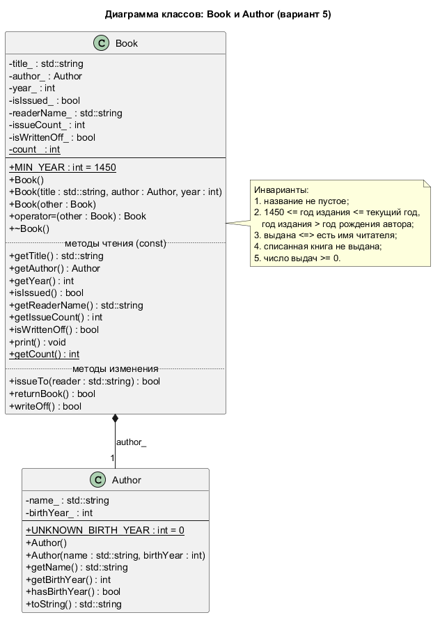

# Лабораторная работа №2 по ООП

[](https://github.com/Vareshka86/Lab2_OOP_try1/releases)

Класс Book (книга из библиотеки) на C++14 — консольная программа по лабораторной работе №2.

Программа выполняет [лабораторную работу №2](https://aleksandr-003.github.io/labs/OOP_z/Labs1_2.html) курса «Объектно-ориентированное программирование и проектирование» (А. Д. Смородинов), вариант 5 — «Книга (из библиотеки) — Book». Работа сдавалась по частям: каждая часть выходила отдельной версией. Выполнены все три части: класс спроектирован, реализованы конструкторы, методы чтения и изменения, деструктор и счётчик объектов, а функция `main()` — тест класса из шести этапов.

```console
$ .\build\lab2.exe
...
==================== Этап 4. Некорректные операции ====================
war.issueTo("Сидоров С. С.")   // книга уже у читателя
  Отказ: книга «Война и мир» уже у читателя (Петров П. П.).
  [OK]     результат: отклонено (ожидалось: отклонено)
...
==================== Этап 6. Независимость объектов ====================
Меняем только war: war.returnBook(); war.writeOff();
...
  [OK]     warCopy (копия war) не изменилась
...
Конец функции runTests(): книги уничтожаются в порядке, обратном созданию
  [-] Уничтожена книга «Мастер и Маргарита» (деструктор). Книг сейчас: 3
  [-] Уничтожена книга «Война и мир» (деструктор). Книг сейчас: 2
  [-] Уничтожена книга «Война и мир» (деструктор). Книг сейчас: 1
  [-] Уничтожена книга «Без названия» (деструктор). Книг сейчас: 0

После runTests() Book::getCount() = 0
  [OK]     все книги уничтожены, счётчик равен 0

Всего проверок пройдено: 36 из 36
```

*Тест класса: отклонённая некорректная операция, независимость копии от оригинала и уничтожение книг в конце теста. Остальной вывод сокращён до `...`.*



*Диаграмма классов в PlantUML (исходник — `uml/Book.puml`).*

## Части работы

| № | Что требуется | Версия | Статус |
|---|---------------|--------|--------|
| 1 | Этапы №1 и №2: описание сущности, таблица проектирования, диаграмма классов; поля, конструкторы (по умолчанию, параметризованный, копирования), методы чтения, вывод | [v0.1](https://github.com/Vareshka86/Lab2_OOP_try1/releases/tag/v0.1) | Выполнено |
| 2 | Методы изменения состояния (`issueTo`, `returnBook`, `writeOff`), явный деструктор, статический счётчик объектов | [v0.2](https://github.com/Vareshka86/Lab2_OOP_try1/releases/tag/v0.2) | Выполнено |
| 3 | Этап №3: функция `main()` — тест класса (корректные и некорректные операции, независимость объектов) | [v1.0](https://github.com/Vareshka86/Lab2_OOP_try1/releases/tag/v1.0) | Выполнено |

## Требования

- Компилятор g++ с поддержкой C++14. Проверено на g++ 16.2.0 (MinGW-w64, Windows 10).
- Doxygen — для сборки документации, необязательно. Проверено на версии 1.18.0.
- PlantUML — чтобы перерисовать диаграмму классов, необязательно. Проверено на версии 1.2026.8 (Java 8).

## Установка

```bash
git clone https://github.com/Vareshka86/Lab2_OOP_try1.git
cd Lab2_OOP_try1
```

Без git: откройте [Releases](https://github.com/Vareshka86/Lab2_OOP_try1/releases), скачайте архив **Source code (zip)** нужной версии и распакуйте его. Обновить клонированный репозиторий: `git pull`.

## Сборка и запуск

**Windows** (cmd или PowerShell):

```console
$ .\build.bat
Сборка успешна: build\lab2.exe
```

```powershell
.\build\lab2.exe
```

Что произошло:

- `build.bat` собрал программу из файлов папки `src` с флагами `-std=c++14 -Wall -Wextra -pedantic -static`; предупреждений компилятора нет.
- Флаг `-static` встраивает библиотеки MinGW в `lab2.exe`, поэтому программа запускается и на компьютере без компилятора. В конце программа ждёт нажатия Enter, чтобы окно не закрылось сразу.

**Linux и macOS** — на этих системах сборка не проверялась:

```bash
g++ -std=c++14 -Wall -Wextra -pedantic -Iinclude src/*.cpp -o lab2
./lab2
```

## Как это работает

Класс `Book` описывает один экземпляр книги в библиотеке: название, автор, год издания, положение (на полке, у читателя или списана) и число выдач. Все поля закрыты (`private`), доступ к ним — через константные методы чтения. Автор — объект отдельного класса `Author`: так выполнено требование, чтобы одно из полей имело пользовательский тип.

Все конструкторы заполняют поля в списке инициализации. Параметризованный конструктор проверяет инварианты — непустое название и год издания от 1450 до текущего года, позже года рождения автора — и при нарушении бросает исключение `std::invalid_argument`, поэтому некорректная книга не может быть создана.

Состояние книги меняют только действия библиотеки: `issueTo` (выдать), `returnBook` (вернуть), `writeOff` (списать). Сеттеров нет. Каждый метод сначала проверяет все условия и при недопустимой операции возвращает `false`, сообщает причину и не меняет ни одно поле. Статическое поле `count_` хранит число существующих книг: его увеличивают все конструкторы, включая конструктор копирования, а уменьшает деструктор, который заодно сообщает о конце жизни объекта.

Функция `main()` — тест класса из шести этапов: создание объектов тремя конструкторами, начальное состояние, корректные операции, некорректные операции (запрещённые вызовы методов и попытки создать объекты с неверными данными), повторный вывод с проверкой инвариантов и независимость объектов. Каждая проверка сравнивает ожидаемый результат с полученным и печатает `[OK]` или `[ОШИБКА]`; в конце выводится итог, а при ошибках программа завершается с кодом 1.

Подробнее — на страницах [«Часть 1. Проектирование класса Book»](pages/design.md), [«Часть 2. Изменение состояния, деструктор и счётчик объектов»](pages/state.md) и [«Часть 3. Тестирование класса»](pages/testing.md).

## Документация

Комментарии в коде оформлены для Doxygen. Соберите документацию:

```bash
doxygen Doxyfile
```

Откройте `docs/html/index.html`. Сборка проходит без предупреждений. Диаграмма классов в документации — готовая картинка `uml/Book.png`, поэтому для сборки документации PlantUML не нужен. Перерисовать картинку после правки `uml/Book.puml`:

```bash
java -jar plantuml.jar -charset UTF-8 -tpng uml/Book.puml
```

Что изменилось в каждой версии — в [CHANGELOG.md](CHANGELOG.md).

## Версии

Каждая часть выполняется в отдельной ветке (`part1`, …), исправления — в ветках `fix-…`. Готовая ветка сливается в `main`, и на результат ставится метка версии: [список версий](https://github.com/Vareshka86/Lab2_OOP_try1/releases).

---

Выполнил: Vareshka86.
